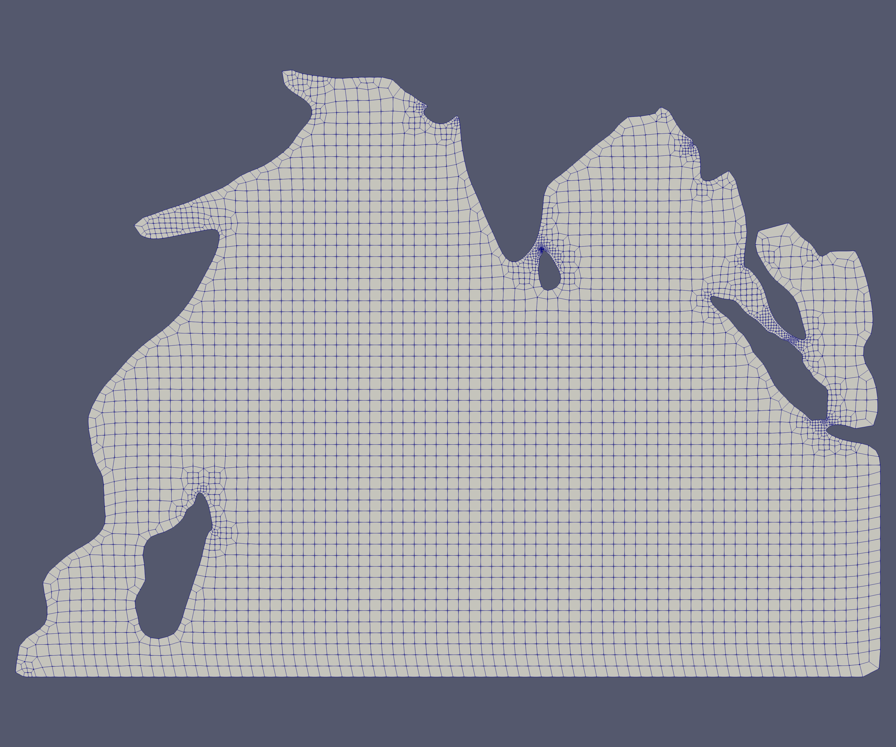

# HOHQMesh User Guide


## Table of Contents

1. [Chapter 1: INTRODUCTION](#introduction)
	2. [Spectral Element Grid Generation](#SpectralElementGridGeneration)
	3. [HOHQMesh](#HOHQMesh)
	4. [Example Meshes](#ExampleMeshes)
2. [Chapter 2: The Model](#TheModel)
	3. [Boundary Curves](#BoundaryCurves)
		4. [The Parametric Equation Curve Definition](#ParametricEqn)
		5. [The Spline Curve Definition](#Spline)
		6. [Endpoints Line Definition](#EndPointsLine)
		7. [Circular Arc Curve](#CircularArc)
		8. [Boundary Chains](#Chains)
	9. [The Model Definition](#TheModel)
3. [Chapter 3: The Control Input](#BoundaryCurves)
	4. [The Run Parameters](#RunParameters)
	5. [The Background Grid](#BackgroundGrid)
	6. [The Smoother](#Smoother)
	7. [Refinement Regions](#RefinementRegions)
		8. [Refinement Centers](#Centers)
		9. [Refinement Lines](#RefinementLines)
		10. [Refinement Region Definition](#RefinementDefinition)
4. [Chapter 4: Three Dimensional Hexahedral Meshes](#3DMeshes)
	5. [Simple Extrusion](#Extrusion)
	6. [Simple Rotation](#Rotation)
	7. [Sweeping](#Sweeping)
	8. [Scaling](#Scaling)
5. [Chapter 5: The Control File](#ControlFile)
6. [Chapter 6: Compiling and Running HOHQMesh](#CompilingRunningIt)
	7. [Compiling the Mesher](#Compiling)
	8. [Running the Mesher](#RunningIt)
7. [Appendix A: Additions for ISM-v2](#ISMv-2)
8. [Appendix B: Summary of Boundary Curve Definitions](#BCSummary)
9. [Appendix C: Summary of Model Definition Blocks](#ModelSummary)
10. [Appendix D: Summary of the Control Block](#ControlSummary)

---
# CHAPTER 1: Introduction<a name="introduction"></a>

Multidomain spectral methods, of which spectral element methods (SEMs) are a subclass, were introduced by Patera  (for elliptic and parabolic equations) and by Kopriva (for hyperbolic systems) to increase the efficiency of spectral methods and to apply them to complex geometries. Although somewhat controversial at the time -- questions were raised whether it was wise to not use the highest order polynomial possible  for a given number of degrees of freedom -- the methods have become so commonly used within the community that the updated book by Canuto et al.  is subtitled  “Fundamentals in Single Domains.”

The features of spectral element methods are now well-established. Like low order finite element methods, they can be applied to general geometries, but have exponential convergence in the polynomial order. Discontinuous Galerkin (DGSEM) versions applied to hyperbolic problems have exponentially low dissipation and dispersion errors, making them well suited for wave propagation problems. They are also especially suitable when material discontinuities are present. Approximations exist for high order quad/hex and tri/tet elements. Numerous examples of the flexibility and the power of spectral element methods can be found in Canuto et al.’s third volume subtitled “Evolution to Complex Geometries”. Textbooks on the subject now exist, such as those by Deville, Fischer and Mund, Sherwin and Karniadakis , Hesthaven and Warburton, and Kopriva.

What some are now calling “classical” spectral element methods use tensor product bases on quadrilateral or hexahedral meshes. These bases lead to very efficient implementations and have high order quadratures that can be used to approximate the integrals found in weak forms of the equations. The methods are being used in a wide variety of fields including fluid dynamics, electromagnetics, geophysics, and fluid-structure interaction problems, just to name a few.  
Unfortunately, meshes for quad/hex elements are considered to be difficult to generate even for low order finite element approximations. This has lead to the development of triangular/tetrahedral spectral element bases. These methods can adapt the meshes generated by virtually all mesh generation packages today in two and three space dimensions. What one gives up in trade is the efficiency of the derivative evaluations, the Gauss quadratures, and meshes well-suited for boundary layer computations.

### Spectral Element Grid Generation<a name="SpectralElementGridGeneration"></a>

The advantages not withstanding, a major frustration in - and impediment to - the application of spectral element methods has been the lack of appropriate general purpose mesh generation software. A survey of the literature, practitioners, and user manuals for available spectral element software packages such as SemTex, SEM2DPack, or Nekton, highlights these difficulties. Blackburn's SemTex page [http://users.monash.edu.au/~bburn/semtex.html]() notes that “Mesh generation can be a significant hurdle to new users” and includes “a number of example meshes ... (most of which were generated by hand).” SEM2DPack's manual says it “can only generate a structured mesh for a single quadrilateral domain, possibly with curved sub-horizontal boundaries and curved sub-horizontal layer interfaces.” Sherwin and Peiro's comment:  “The ability to construct suitable computational meshes is currently a significant limiting factor in the development of compact high-order algorithms in very complex geometries” still holds today. Canuto et al. do not even broach the subject. 

Simply put, and avoiding the common colloquialism, the state of the art in spectral element grid generation has been dismal.
One finds that spectral element meshes are either generated “by hand”, by special purpose mesh generators, or by low order finite element packages. Examples of hand generated meshes can be found in the textbooks listed above, for instance. SEM2DPack interfaces with the low order finite element mesh generator EMC2. The Nekton and SemTex packages interface with the finite element package GMSH. But the situation is particularly difficult for ``classical'' quad and hex element codes since even low order finite element mesh generators for these elements are hard to find. A consequence is that one even finds meshes in the literature that are simple quad/hex decompositions of low order triangular/tetrahedral meshes. 
The meshes that practitioners generate differ greatly from those generated by finite element mesh generators. The reason is not just a matter of the tedium associated with the process. Spectral element approximations encourage the use of larger elements with curved boundaries approximated at high order. Meshes generated by hand or with simple templates tend to have fewer and larger elements. 

Meshes generated by finite element packages designed for low order elements generate huge numbers of small elements and do not exploit the efficiency of high order spectral element approximations. The use of standard generators can lead one to use a high order method, yet approximate curved boundaries as segments of straight lines. Commercial mesh generators that generate “higher order elements”, e.g.  PATRAN, GMSH or Gambit, do exist, but high order usually means third order, tops. ICEM-HEXA will guarantee quad/hex spectral element type meshes only for block structured meshes. The costs of commercial packages, however, are so far above the budgets provided by the typical NSF grant or mathematics department and so aren’t an option even if they could generate spectral element meshes.

### HOHQMesh<a name="HOHQMesh"></a>
For these reasons we have developed the High Order Hex-Quad Mesh (HOHQMesh) package to automatically generate all-quadrilateral meshes with high order boundary information to be used in spectral element computations. It also can take such two dimensional meshes and extrude them in the normal direction to general all hex meshes for simple extrusion type geometries. Sinc

## Example Meshes<a name="ExampleMeshes"></a>

Before going into details, we show some meshes that have been generated by HOHQMesh. Control files for generating these meshes can be found in the ControlFiles directory. Some of the meshes show internal spectral element degrees of freedom and the fully accurate boundary representations. Others show only the quad or hex shape of the elements as given in the plot file generated by the program.

The first example is a full spectral element mesh for three circles within an outer circle. HOHQMesh is fully automatic and sizes the elements according to the geometry. 

<p align="center">
  
</p><p align = "center"> Fig. 1. Sixth order spectral element mesh of three circles within a circle</p>

The second example example shows that general curves can be used to define the boundaries. This time, a set of points and a spline are use to define the outer boundary.
<p align="center">
  
</p>
<p align = "center"> Fig. 2. Eighth order spectral element mesh of a domain bounded by a spline curve

HOHQMesh has templates to automatically mesh around sharp corners.  
<p align="center">
  
</p>
<p align = "center"> Fig. 3. Spectral element mesh of a domain with sharp corners

This makes it possible to mesh airfoil type geometries.
<p align="center">
  
</p>
<p align = "center"> Fig. 4. Mesh of a NACA0012 airfoil<p align="center">
  
</p>
<p align = "center"> Fig. 5. Mesh for a three element Karman-Treffiz airfoil

Local refinement can be added manually, either at a point or along a line.
<p align="center">
  
</p>
<p align = "center"> Fig. 6. Mesh showing manual refinement along a line and at a point

Truly complex geometries can be meshed, as shown in the following coastline models. Refinement around features is automatic.
<p align="center">
  
</p>
<p align = "center"> Fig. 7. The Indian Ocean

<p align="center">
  
</p>
<p align = "center"> Fig. 8. Lake Superior with specral element nodes shown.

Finally, hex meshes can also be created by sweeping a quad mesh. The simplest way is to extrude a two-dimensional mesh in one of the coordinate directions. 

<p align="center">
  
</p>
<p align = "center"> Fig. 9. Simple extrusion of the mesh in Fig. 3

Or the mesh can be rotated along a coordinate axis through a specified angle,

<p align="center">
  
</p>
<p align = "center"> Fig. 10. Simple rotation of the mesh in Fig. 3

More sophisticated extrusions can be created by sweeping along a curve,

<p align="center">
  
</p>
<p align = "center"> Fig. 11. Hex mesh generated by sweeping along a curve

Finally, swept meshes can also be scaled along the curve.
<p align="center">
  
</p>
<p align = "center"> Fig. 12. Hex mesh generated by sweeping and scaling along a curve

All told, the geometries that can be meshed can be quite general.
<p align="center">
  
</p>

---
# Chapter 2: The Model<a name="TheModel"></a>
At the present time, HOHQMesh is designed to generate quadrilateral meshes in general two dimensional geometries like those shown below, and extrusions thereof to get three dimensional hex meshes.
<p align="center">
  
</p>
<p align = "center"> Fig. 13. Meshable regions

The two dimensional domain to be meshed can be bounded by at most one exterior boundary curve (which can be composed of a chain or curves), as in (a) and (b), above, and any number of interior boundary curves that create holes. For purely external problems, a rectangular outer boundary can be implicitly included, as shown in (c).


## Boundary Curves<a name="BoundaryCurves"></a>

<p align="center">
  
</p>
<p align = "center"> Fig. 14. A mesh whose model uses all curve types. Three *END_POINTS_LINE*s for the outer triangle. A *SPLINE_CURVE* for the free-form inner boundary, and circles defined by a *PARAMETRIC_EQUATION_CURVE* and by a *CIRCULAR_ARC* curve.</p>

Boundaries are constructed as closed chains of parametrized curves, with the parameter in the interval [0,1], oriented counter-clockwise. The chains can have one or more segments as seen in Fig. 14. In Fig. 14a the outer boundary is constructed from six curves, whereas in Fig. 14b it is bounded by a single one. The inner boundaries in Fig. 14a are a single circle and a square constructed by a chain of four lines.

A curve is defined by a block 

	\begin{curve_type}
		...
	\end{curve_type}

It is given a name so that boundary conditions can be applied segment-by-segment to a chain. 

Currently there are four types of curves that can be defined:

*  Curves defined by equation components. 
*  Cubic spline interpolants of a set of nodal points. 
*  Straight lines between two points.
*  Circular arcs. 

Fig. 6 is an example that uses all four curve-type definitions.

The architecture is designed to easily add curve definitions in the future by creating subclasses of the SMCurveClass.

### The Parametric Equation Curve Definition.<a name="ParametricEqn"></a> 

Curves can be defined by strings that define the equations for the (x,y,z) components of the curve using the *PARAMETRIC\_EQUATION\_CURVE* type. An example block for this kind of curve is

	\begin{PARAMETRIC_EQUATION_CURVE}
		name = circle
		xEqn = x(t) = 14.0*cos(2*pi*t)
		yEqn = y(t) = 14.0*sin(2*pi*t)
		zEqn = z(t) = 0.0
	\end{PARAMETRIC_EQUATION_CURVE}

The first line defines the name, followed by the x- , y- and z- equation definitions. **Right now, only meshes in the x-y plane can be generated, so the z=0 equation must be set this way**. The example block defines a closed circular curve of radius 14 named “circle”. The indenting is optional, as is the ordering of the keys within the block. The keywords are “name”, “xEqn”, etc. and must be spelled correctly or an error will be posted when the model is read in. The zEqn keyword is optional and can be left out.

The equations can be any legal representations of an equation as is standard in most computer languages. The first part, before the equals sign defines the parameter variable, in this case, t. On the right hand side is the formula that defines the curve. Exponentiation is defined as in BASIC, like t^2. For convenience, the constant **pi** is defined. Like BASIC, literals are defined as double precision values. There are no integer quantities. Standard functions like sin, cos, tan, atan, log, log10, exp, etc. are also available for use.

### The Spline Curve Definition<a name="Spline"></a>
The second type of curve is the SplineCurve type, which fits a cubic spline to a set of knots at given parameter values. The parameterization does not have to be uniform. An example of a spline-defined curve is

	\begin{SPLINE_CURVE}
		name = SplineBoundaryCurve
		nKnots = 9
		\begin{SPLINE_DATA}
			0.000000000000000 -3.50000000000000  3.50000000000000 0.0
			3.846153846153846E-002 -3.20000000000000  5.00000000000 0.0
			7.692307692307693E-002 -2.00000000000000  6.00000000000 0.0
			0.769230769230769  0.000000000000000 -1.00000000000000 0.0
			0.807692307692308 -1.00000000000000 -1.00000000000000 0.0
			0.846153846153846 -2.00000000000000 -0.800000000000000 0.0
			0.884615384615385 -2.50000000000000  0.000000000000000 0.0
			0.923076923076923 -3.00000000000000  1.00000000000000 0.0
			1.00000000000000 -3.50000000000000  3.50000000000000 0.0
		\end{SPLINE_DATA}
	\end{SPLINE_CURVE}

As before, the first line after the \begin is the name of the curve. It is followed by the number of nodes in the spline. The data columns that follow are the nodes given by tj,xj,yj,zj. This particular spline is closed, so the location of the last node is the same as the first. Again, the zj values must currently be zero to ensure that curves are in the x-y plane.

### Endpoints Line Definition<a name="EndPointsLine"></a>
The next type of curve is the *END\_POINTS\_LINE* type that takes two end points and puts a straight line between them. An example is

	\begin{END_POINTS_LINE}
		name   = B1
		xStart = [0.0,1.0,0.0]
		xEnd   = [2.0,1.0,0.0]
	\end{END_POINTS_LINE}

### Circular Arc Curve<a name="CircularArc"></a>

The final type of curve defines a circular arc. The angles can be defined either in terms of degrees or radians. If the (optional) units keyword is not included, the default is radians.

	\begin{CIRCULAR_ARC}
		name        = circle
		units       = degrees
		center      = [0.0, 0,0,0.0]
		radius      = 4.0
		start angle = 0.0
		end angle   = 180.0
	\end{CIRCULAR_ARC}

## Boundary Chains<a name="Chains"></a>

To allow complex boundary curves and to allow different portions of a boundary to have different boundary conditions applied, curves can be chained together into a closed curve. A chain is defined by curves specified (in order) within a 

	\begin{CHAIN}
	...
	\end{CHAIN} 

block. Any number of curves can be chained together. The chain itself is also given a name. An example of a chain that defines the boundary of a unit square is

	\begin{CHAIN}
		name = UnitSquare
		\begin{PARAMETRIC_EQUATION_CURVE}
			name = bottom
			xEqn = f(t) = t
			yEqn = f(t) = 0
			zEqn = f(t) = 0
		\end{PARAMETRIC_EQUATION_CURVE}

		\begin{PARAMETRIC_EQUATION_CURVE}
			name = right
			xEqn = f(t) = 1
			yEqn = f(t) = t
			zEqn = f(t) = 0
		\end{PARAMETRIC_EQUATION_CURVE}

		\begin{PARAMETRIC_EQUATION_CURVE}
			name = top
			xEqn = f(t) = 1-t
			yEqn = f(t) = 1
			zEqn = f(t) = 0
		\end{PARAMETRIC_EQUATION_CURVE}

		\begin{PARAMETRIC_EQUATION_CURVE}
			name = bottom
			xEqn = f(t) = 0
			yEqn = f(t) = 1-t
			zEqn = f(t) = 0
		\end{PARAMETRIC_EQUATION_CURVE}
	\end{CHAIN}

Again, the indentation is for readability only, as is the line spacing between the blocks. (Blank lines and lines starting with “%” are ignored.) Also remember that the chain is defined counter-clockwise, and the curves within the chain must be ordered and oriented properly. Chains cannot be chained together.

## The Model Definition<a name="TheModel"></a>
The model (there is only one) defines the region that is to be meshed. It is marked by 

	\begin{MODEL}
	...
	\end{MODEL}

The model contains at most one outer boundary chain and any number of inner boundary chains. The outer boundary chain (if there is one) is defined by

	\begin{OUTER_BOUNDARY}
	...
	\end{OUTER_BOUNDARY}

Within the *OUTER_BOUNDARY* block is a list of boundary curves that form a chain. There is no need to explicitly chain (by way of \begin{CHAIN}...\end{CHAIN}) the curves for the outer boundary, as that is implied.

Inner boundaries (if any) are defined within

	\begin{INNER_BOUNDARIES}
	...
	\end{INNER_BOUNDARIES}

Within this block one defines as many CHAINs as there are inner boundaries. **Each inner boundary must be defined within a chain**. (Even if there is only one curve in the chain.) The order of the CHAINs is not important. 

As an example, the following defines a model that has a single circular outer boundary and three inner circular boundaries. As usual, indentation is for the reader’s eyes only. Note that *between* the blocks, comments can be inserted starting with “%”.


	\begin{MODEL}
		\begin{OUTER_BOUNDARY}
			\begin{PARAMETRIC_EQUATION_CURVE}
				name = outer
				xEqn = x(t) = 14.0*cos(2*pi*t)
				yEqn = y(t) = 14.0*sin(2*pi*t)
				zEqn = z(t) = 0.0
			\end{PARAMETRIC_EQUATION_CURVE}
		\end{OUTER_BOUNDARY}
	%
	%	Inner boundaries, if any, are any number of chains
	%	of curves.
	% 
		\begin{INNER_BOUNDARIES}
			\begin{CHAIN}
				name = Boundary 1
				\begin{PARAMETRIC_EQUATION_CURVE}
					name = Circle1
					xEqn = f(t) = -10.25 + 0.2*cos(2*pi*t)
					yEqn = f(t) = 3.0 + 0.2*sin(2*pi*t)
					zEqn = z(t) = 0.0
				\end{PARAMETRIC_EQUATION_CURVE}
			\end{CHAIN}

		   \begin{CHAIN}
			name = Boundary 2
 			\begin{PARAMETRIC_EQUATION_CURVE}
				name = Circle2
				xEqn = f(t) = -5.1 + 1.0*cos(2*pi*t)
				yEqn = f(t) = 1.0*sin(2*pi*t) - 4.1
				zEqn = z(t) = 0.0
			\end{PARAMETRIC_EQUATION_CURVE}
		   \end{CHAIN}

		   \begin{CHAIN}
		     name = Boundary 3
	            \begin{PARAMETRIC_EQUATION_CURVE}
				name = Circle3
				xEqn = f(t) = -12.0 + 0.5*cos(2*pi*t)
				yEqn = f(t) = 0.5*sin(2*pi*t) - 0.5
				zEqn = z(t) = 0.0
		      \end{PARAMETRIC_EQUATION_CURVE}
	   		\end{CHAIN}
		\end{INNER_BOUNDARIES}
	\end{MODEL}

---
# Chapter 3: The Control Input<a name="ControlInput"></a>
---

The meshing of the model is controlled by the *CONTROL_INPUT* block of the input control file, which gives all of the commands needed to mesh the model. Actually, there are not a lot of commands at the moment, so that’s not too bad. The control block is

	\begin{CONTROL_INPUT}
	...
	\end{CONTROL_INPUT}

Inside the control input block the *RUN\_PARAMETERS*, *BACKGROUND\_GRID*, *SMOOTHER*, and any number of *REFINEMENT\_CENTER*s and *REFINEMENT\_LINE*s  are defined.

## The Run Parameters<a name="RunParameters"></a>

The *RUN\_PARAMETERS* block defines the file information and the polynomial order at which the boundary curves will be defined in the mesh file. Three files can be output by the mesher. The first is the actual mesh file. The second is a tecplot format file that can be used to visualize the mesh. The free programs VisIt or Paraview can be used to plot tecplot files. The final file (optional) is to report mesh statistics, like the distribution of largest angle, Jacobian, etc. See the “Verdict Library Reference Manual” by Stimpson et al. if you are interested to learn about the different shape quality measures. Include a unix style path to choose the directory for the results.

The RUN_PARAMETERS block is:

	\begin{RUN_PARAMETERS}
		mesh file name   = MeshFileName.mesh
		plot file name   = PlotName.tec
		stats file name  = StatsName.txt
		mesh file format = ISM OR ISM-v2
		polynomial order = 6
		plot file format = skeleton OR sem
	\end{RUN_PARAMETERS}

The names can be anything, since they are simply text files. However the “.tec” extension on the plot file will help VisIt/Paraview know how to read it. If you don’t want a file created, simply choose the name to be *none*. 

In the current version of  HOHQMesh, there are two mesh file formats, “ISM” which stands for “Implementing Spectral Methods” . This is the file format described in the book by David A. Kopriva. The other format is “ISM-v2”, which provides the edge information needed by the approximations so that the edge generation algorithms in the appendix of the book are not needed. See the section in this manual on ISM-v2 for a description of the additional information provided. In the future, other file formats may be implemented, too. Finally, high order boundary information is conveyed by outputting an interpolant of the specified order. That information can be viewed using the “sem” plot file format.

## The Background Grid<a name="BackgroundGrid"></a>

The meshing algorithm starts with a uniform background grid. If an outer boundary is specified in the model, HOHQMesh will create this background grid using the extents of the outer boundary and the background grid size specified in the *BACKGROUND\_GRID* block. If there is no outer boundary, then the background grid must be specified in the control input. The *BACKGROUND\_GRID* block specifies the coordinates of the lower left corner of the grid, the grid size in each coordinate direction, and the number of  grid cells in each direction:

	\begin{BACKGROUND_GRID}
		x0 = [-10.0, -10.0, 0.0]
		dx = [2.0, 2.0, 0.0]
		N  = [10,10,0]
	\end{BACKGROUND_GRID}

The example above creates a uniform grid with lower left corner at (-10,10) and upper right corner at (10,10).

Alternatively, if there is an outer boundary curve, you want to specify the background grid size and let HOHQMesh compute the rest of the parameters:

	\begin{BACKGROUND_GRID}
		background grid size = [2.0,2.0,0.0]
	\end{BACKGROUND_GRID}

## The Smoother<a name="Smoother"></a>
It is generally necessary to smooth the mesh after it is generated. Smoothing is done by the Smoother. 

The *SPRING\_SMOOTHER* uses a spring-dashpot model and time relaxation to smooth the mesh. There are two spring topologies “LinearSpring” and “LinearAndCrossbarSpring”. The first only has springs between the nodes along the edges. The latter also puts springs along the diagonals of an element. The latter is preferred. The springs have a spring constant associated with them and a dashpot with a damping coefficient. The nodes have mass. The linear ODE system that describes the motion of the nodes is integrated with a forward Euler (Explicit!) approximation for which a time step and number of time steps are given. The *SPRING\_SMOOTHER* block, if one is used (Recommended!)  is

	\begin{SPRING_SMOOTHER}
		smoothing            = ON **or** OFF (Optional)
		smoothing type       = LinearAndCrossbarSpring **or** LinearSpring
		spring constant      = 1.0 (Optional)
		mass                 = 1.0 (Optional)
		rest length          = 0.0 (Optional)
		damping coefficient  = 5.0 (Optional)
		number of iterations = 20
		time step            = 0.1 (Optional)
	\end{SPRING_SMOOTHER}

Just leave out any of the optional parameters if you want the default values to be used. The default values should be sufficient, but the additional flexibility might be useful on occasion.

## Refinement Regions<a name="RefinementRegions"></a>
<p align="center">
  
</p><p align = "center"> Fig. 15. Two refinement centers and a refinement line

Manual scaling of the mesh size can be performed by including any combination of

* Refinement Centers
* Refinement Lines

### Refinement Centers<a name="Centers"></a>
It is possible to ask HOHQMesh to locally refine the mesh at particular locations. This is done with a *REFINEMENT\_CENTER* placed as desired. Two types of centers are available. One is “smooth”, which refines near a specified point and gradually de-refines towards the neighboring mesh size. The other is “sharp”, which keeps the refined size in the neighborhood of the center. The desired mesh size and the size of the center are also parameters. An example of a refinement center is

	\begin{REFINEMENT_CENTER}
		type = smooth **or** sharp
		x0   = [1.0,1.0,0.0]
		h    = 0.20
		w    = 0.5
	\end{REFINEMENT_CENTER}

This will place a center at (1,1,0) with mesh size of 0.2 over a circular region of radius  0.5 . Any number of RefinementCenters can be included. The order in which they are defined is not important.

### Refinement Lines<a name="RefinementLines"></a>
The mesh can also be refined along a line using a *REFINEMENT\_LINE*. Like the centers, there are two types, “smooth” and “sharp”. To refine along a line, include a block of the form 

	\begin{REFINEMENT_LINE}
		type = smooth **or** sharp
		x0   = [-3.5,-3.5,0.0]
		x1   = [3.0,3.0,0.0]
		h    = 0.20
		w    = 0.5
	\end{REFINEMENT_LINE}

Here, *x0* and *x1* are the starting and ending points of the line, *h* is the desired mesh size and *w* tells how far out from the line the refinement extends. An example of center and line refinements can be seen in Fig. 15.
### Refinement Region Definition<a name="RefinementDefinition"></a>

Refinement regions are defined within a *REFINEMENT\_REGIONS* block, e.g.  

	\begin{REFINEMENT_REGIONS}

      \begin{REFINEMENT_LINE}
          type = nonsmooth
          x0   = [-3.0,-3.0,0.0]
          x1   = [3.0,3.0,0.0]
          h    = 0.3
          w    = 0.3
       \end{REFINEMENT_LINE}

       \begin{REFINEMENT_CENTER}
          type = smooth
          x0   = [3.0,-3.0,0.0]
          h    = 0.1
          w    = 0.3
       \end{REFINEMENT_CENTER}

	\end{REFINEMENT_REGIONS}
---
# Chapter 4: Three Dimensional Hexahedral Meshes<a name="3DMeshes"></a>
---
HOHQMesh can also generate 3D hexahedral meshes by extruding or sweeping a two dimensional mesh. 

To tell the mesher that you want a hex mesh, you add an algorithm block to the *CONTROL\_INPUT* block for how the 3D extrusion will be done. Currently there are three: 

* Simple extrusion, 
* Simple rotation, and 
* Sweeping.

## Simple Extrusion<a name="Extrusion"></a>
	   

<p align = "center"> Fig. 16. Simple Extrusion of a semi-circular quadrilateral mesh

The first hex-meshing algorithm is the *SIMPLE\_EXTRUSION* algorithm.

    \begin{SIMPLE_EXTRUSION}
		 direction          = 3
		 height             = 8.0
		 subdivisions       = 8
		 start surface name = bottom
		 end surface name   = top
	 \end{SIMPLE_EXTRUSION}

The direction (where *x* = 1, *y* = 2, z = *3*) says which direction the extrusion is done. Note that even though the initial 2D mesh is in the x-y plane, the quad mesh is rotated to give a hex mesh extruded in the requested direction. The height tells how far to extrude. A name is given to the bottom and top faces created by the extrusion so that boundary conditions can be attached. Otherwise, the names of the faces are given by the 2D curve names.

## Simple Rotation<a name="Rotation"></a>


<p align = "center"> Fig. 17. Simple rotation of the mesh in Fig. 3

The second algorithm is the *SIMPLE\_ROTATION*, which rotates the two dimensional mesh about an  axis

    \begin{SIMPLE_ROTATION}
       direction             = 1
       rotation angle factor = 1.0
       subdivisions          = 8
       start surface name    = bottom
       end surface name      = top
    \end{SIMPLE_EXTRUSION}
   
The rotation andle factor is the fraction of pi over which the quad mesh is rotated. An example is shown below of an original two dimensional mesh  
and its rotation about the x axis (direction = 1) is shown in Fig. 17.

## Sweeping<a name="Sweeping"></a>

<p align = "center"> Fig. 18. Hex mesh generated by sweeping a circular mesh along a curve

 The most general algorithm for generating hex meshes in HOHQMESH is to sweep a two-dimensional mesh along a prescribed curve, *SWEEP\_ALONG\_CURVE*. To sweep along a curve, one does two things: 
 
1.  Add  a *SWEEP\_ALONG\_CURVE* block to the *CONTOL\_INPUT* block and 
2.  Add the curve along which the sweeping is to be done to the *MODEL* block.
 
There are currently two sweeping algorithms available. The default is a simple rotation algorithm that has no method to counteract twisting of the mesh as it follows the curve. (Think of a roller-coaster that can turn upside down as it follows a curved track.) The default algorithm is exact so will sweep the curve to high order, but will only produce an untwisted mesh if the curve is planar.

The second is a parallel transport algorithm due to Hanson and Ma that keeps arbitrary vector in a particular orientation with respect to its initial direction. The parallel transport approach minimizes the twisting of the hex mesh, but is only second order accurate. [A fourth order algorithm may be implemented in the future.]

To implement sweeping, include a SWEEP_ALONG_CURVE block in the *CONTOL\_INPUT* block:

    \begin{SWEEP_ALONG_CURVE}
	    algorithm                = Hanson (optional)
       subdivisions per segment = 8
       start surface name       = bottom
       end surface name         = top
    \end{SWEEP_ALONG_CURVE}
   
The algorithm keyword is optional. If not present, the sweeping will not include the parallel transport correction. Since the sweep curve can be a chain with slope or curvature singularities, the number of subdivisions per segment is defined. This ensures that a singularity occurs along element boundaries so that accuracy is not lost. 

The curve itself is defined in the MODEL block. 

	\begin{SWEEP_CURVE}
		...
	\end{SWEEP_CURVE}

The *SWEEP\_CURVE* block implicitly defines a *CHAIN*, like the *OUTER\_BOUNDARY* block, and so only needs a list of curves to define the sweep.

## Scaling<a name="Scaling"></a>

<p align = "center"> Fig. 19. Hex mesh generated by sweeping and scaling along a curve

The mesh can also be scaled in the direction normal to the sweep curve when sweeping is used. 
To scale the mesh, add a

	\begin{SWEEP_SCALE_FACTOR}
		...
	\end{SWEEP_SCALE_FACTOR}

block to the *MODEL*. Like the *SWEEP\_CURVE* and *OUTER\_BOUNDARY* blocks, the *SWEEP\_SCALE\_FACTOR* block implicitly defines a *CHAIN*. You do not need to have the number chain segments match the number in the *SWEEP\_ALONG\_CURVE* block, but it is probably best to not introduce slope or curvature singularities except at element interfaces.

The equation for the scaling is scalar *PARAMETRIC\_EQUATION* (as opposed to a *PARAMETRIC\_EQUATION\_CURVE*). It is defined, for example like this:

        \begin{PARAMETRIC_EQUATION}
           eqn = r(t) = 1.0 + 2.5*t*(1-t)
        \end{PARAMETRIC_EQUATION}
        
## Bottom Topography<a name="Topography"></a>

<p align = "center"> Fig. 20. Simple Extrusion of a semi-circular mesh with bottom topography

When using the *SIMPLE\_EXTRUSION* algorithm, bottom topography can be added as shown below: 
At this time, the bottom topography is defined only as an equation in a TOPOGRAPHY block, e.g.

        \begin{TOPOGRAPHY}
           eqn = h(x,y) = x^2 + y^2
        \end{TOPOGRAPHY}
        
The height function takes two arguments, which are the physical x-y coordinates, unlike the parametric coordinates that define boundary curves.

Currently the only way to define bottom topography is through an equation as above. However that limitation can be overcome by implementing other bottom topography subclasses.

---
# Chapter 5: The Control File<a name="ControlFile"></a>
---

The *MODEL* and the *CONTROL\_INPUT* blocks described above are put into a single file called the **control file**, which is finished with a *\end{FILE}* command. An example of a full control file that meshes a model with a circular outer boundary and two inner circular boundaries, and writes out a plot file with spectral element resolution,
is shown below:

	\begin{CONTROL_INPUT}
	
	   \begin{RUN_PARAMETERS}
	      mesh file name         = Circles3Mesh.mesh
	      plot file name         = Circles3Plot.tec
	      statistics file name   = Circles3Stats.txt
	      mesh file format       = ISM
	      polynomial order       = 6
	      plot file format       = sem
	   \end{RUN_PARAMETERS}
	
	   \begin{BACKGROUND_GRID}
	     background grid size = [4.0,4.0]
	   \end{BACKGROUND_GRID}
	
	   \begin{SPRING_SMOOTHER}
	     smoothing type       = LinearAndCrossbarSpring
	     number of iterations = 20
	   \end{SPRING_SMOOTHER}
	
	\end{CONTROL_INPUT}
	
	\begin{MODEL}

		\begin{OUTER_BOUNDARY}
	   		\begin{PARAMETRIC_EQUATION_CURVE}
			 	name = outer
		 		xEqn = x(t) = 14.0*cos(2*pi*t)
		 		yEqn = y(t) = 14.0*sin(2*pi*t)
		 		zEqn = z(t) = 0.0
	  	 	\end{PARAMETRIC_EQUATION_CURVE}
		\end{OUTER_BOUNDARY}

		\begin{INNER_BOUNDARIES}
	
	   		\begin{CHAIN}
		       	name = Boundary 1
	           	\begin{PARAMETRIC_EQUATION_CURVE}
						name = Circle1
						xEqn = f(t) = -10.25 + 0.2*cos(2*pi*t)
						yEqn = f(t) = 3.0 + 0.2*sin(2*pi*t)
						zEqn = z(t) = 0.0
		       	\end{PARAMETRIC_EQUATION_CURVE}
	  		\end{CHAIN}
	   
	   		\begin{CHAIN}
	      	 	name = Boundary 2
	           \begin{PARAMETRIC_EQUATION_CURVE}
					name = Circle2
					xEqn = f(t) = -5.1 + 1.0*cos(2*pi*t)
					yEqn = f(t) = 1.0*sin(2*pi*t) - 4.1
					zEqn = z(t) = 0.0
	      		\end{PARAMETRIC_EQUATION_CURVE}
	   		\end{CHAIN}
	   
	   		\begin{CHAIN}
		       	name = Boundary 3
	           	\begin{PARAMETRIC_EQUATION_CURVE}
					name = Circle3
					xEqn = f(t) = -12.0 + 0.5*cos(2*pi*t)
					yEqn = f(t) = 0.5*sin(2*pi*t) - 0.5
					zEqn = z(t) = 0.0
	      		\end{PARAMETRIC_EQUATION_CURVE}
	   		\end{CHAIN}
		\end{INNER_BOUNDARIES}
	\end{MODEL}
	\end{FILE}	
Just a a note, blocks do not have to be specified in any order (e.g. the *MODEL* could come first before the *Control\Input*, *INNER\_BOUNDARIES* could come before *OUTER\_BOUNDARY*. Keywords within a block can be specified in any order. The only ordering that is important is that within a *CHAIN*, the curves must be specified in order, counter-clockwise.

---
# CHAPTER 6: Compiling and Running HOHQMesh<a name="CompilingRunningIt"></a>
---
## Compiling the Mesher<a name="Compiling"></a>
HOHQMesh is currently being distributed on gitHub. In that repository is a makefile, plus source, documentation (which contains this document) and a directory of examples.

HOHQMesh is written in fortran90. It is known to compile and run with gfortran on Mac/Linux/Windows. Let us know if there are issues with other compilers. Or more recent versions of those.

The mesher has one dependency, FTObjectLibrary, which supplies the container classes and exception classes. It is also available on gitHub under a project of that name. 

The makefile is for gmake. Use it to compile the mesher.

To build, edit the `Makefile` file as indicated in the header and move to
ones favorite directory. Type
```
make
```
That will build HOHQMesh.


## Running the Mesher<a name="RunningIt"></a>


To run the tests, type

```bash
./HOHQMesh -test -path <pathToBenchmarks>
```
where `<pathToBenchmarks>` is the path to the HOHQMesh directory.

To mesh a control file, type

```bash
./HOHQMesh -f <pathToControlFile>
```

For example, to mesh the GingerbreadMan model in the Examples directory, type

>./HOHQMesh -f Examples/2D/GingerbreadMan/GingerbreadMan.control


The mesh and plot files will be created relative to the directory of the executable. For the moment, until things get really robust, diagnostic information can be printed as the program executes. 

Three more compiler flags are also defined:

* **-version**		Gives the version number of the code
* **-help**			Does nothing at the moment. Sorry. RTM.
* **-verbose**		Determines whether progress messages are printed or not.

Use these as usual, e.g.

>./HOHQMesh -verbose -f Examples/2D/GingerbreadMan/GingerbreadMan.control

# Appendix A: Additions for ISM-v2<a name="ISMv-2"></a>
The ISM-v2 adds edge information to the mesh file. 

The first line of the mesh file will state that fact, that is, if the first line is ISM-V2 then it will have the edge information. 

Line 1:

 	ISM-V2
 
The second line now also includes the number of edges in the mesh as follows:

	#nodes, #edges, #elements, polynomial order of boundary edges
	
The edges are read immediately after the nodes. For each edge the following are listed:

	start node ID, end node ID, element ID on left, element ID on right, side of left element, side of right element
	
These are the quantities that are computed in Alg. 148 of "Implementing Spectral Methods". If the edge is a boundary edge, then the second side element will be ID = 0 and the side of that element will be 0. If the sides have indices that increase in opposite directions, then the last column in the data will be negative.
# Appendix B: Summary of Boundary Curve Definitions<a name="BCSummary"></a>

Defining a parametric equation:

	   \begin{PARAMETRIC_EQUATION_CURVE}
		 name = <name>
		 xEqn = x(t) = <x-equation>
		 yEqn = y(t) = <y-equation>
		 zEqn = z(t) = 0.0
	 \end{PARAMETRIC_EQUATION_CURVE}
	 
Defining a Spline:

	\begin{SPLINE_CURVE}
	   name = <name>
	   nKnots = # of nodes
        \begin{SPLINE_DATA}
	      t x y z
	      .
	      .
	      .
        \end{SPLINE_DATA}
	 \end{SPLINE_CURVE}
	 
Defining a Straight Line

      \begin{END_POINTS_LINE}
	 	name   = <name>
	 	xStart = [x,y,0]
           xEnd   = [x,y,0]
      \end{END_POINTS_LINE}
      
Defining a Circular Arc

      \begin{CIRCULAR_ARC}
	 	name 		 = <name>
		units 	 =degrees/radians(Optional.Default:radians)
	 	center 	 = [x,y,0]
           radius 	 = r
		start angle = Tstart
		end angle   = Tend
      \end{CIRCULAR_ARC}
      
Chaining curves

	\begin{CHAIN}
		name = <Chain Name>
		First curve definition
		Second curve definition
		...
		Last curve definition
	\end{CHAIN}
# Appendix C: Summary of Model Definition Blocks<a name="ModelSummary"></a>

No inner boundaries:

	   \begin{MODEL}
	 	\begin{OUTER_BOUNDARY}
			First curve definition
			Second curve definition
			...
			Last curve definition
	 	\end{OUTER_BOUNDARY}
	\end{MODEL}
	
No outer boundaries:

	   \begin{MODEL}
	 	\begin{INNER_BOUNDARIES}
			First chain definition
			Second chain definition
			...
			Last chain definition
	 	\end{INNER_BOUNDARIES}
	\end{MODEL}
	
Both inner and outer boundaries:

	   \begin{MODEL}
	 	\begin{OUTER_BOUNDARY}
			First curve definition
			Second curve definition
			...
			Last curve definition
	 	\end{OUTER_BOUNDARY}
	 	\begin{INNER_BOUNDARIES}
			First chain definition
			Second chain definition
			...
			Last chain definition
	 	\end{INNER_BOUNDARIES}
	\end{MODEL}

# Appendix D: Summary of the Control Block<a name="ControlSummary"></a>

The control block (required): 

	\begin{CONTROL_INPUT}
		...
	\end{CONTROL_INPUT}
	
The run parameters (required):
	
	\begin{RUN_PARAMETERS}
	  mesh file name   = <pathToMeshFile>
	  plot file name   = <pathToPlotFile>
	  stats file name  = <pathToStatsFile> **or** none
	  mesh file format = ISM **or** ISM-v2
	  polynomial order = Boundary polynomial order
	  plot file format = skeleton **or** sem
	\end{RUN_PARAMETERS}

To specify the background grid (required):
	
	\begin{BACKGROUND_GRID}
	  background grid size = [x,y,0.0]
	\end{BACKGROUND_GRID}

if there is an outer boundary curve in the model. If there is no outer boundary, just an implied box, then use
	
	\begin{BACKGROUND_GRID}
	   x0 = [xLeft, yBottom, 0.0]
	   dx = [dx, dy, 0.0]
	   N  = [Nx,nY,0]
	\end{BACKGROUND_GRID}

Smoothing is recommended (highly!)
	
	\begin{SPRING_SMOOTHER}
	  smoothing            = ON **or** OFF
	  smoothing type       = LinearAndCrossbarSpring **or* LinearSpring
	  number of iterations = typically 20-30
	\end{SPRING_SMOOTHER}

If manual local refinement is desired, include

	\begin{REFINEMENT_REGIONS}
		...
	\END{REFINEMENT_REGIONS}

with blocks of the types

       \begin{REFINEMENT_CENTER}
          type = smooth **or** sharp
          x0   = [xCenter,-yCenter,0.0]
          h    = mesh size
          w    = radial extent
      \end{REFINEMENT_CENTER}

       \begin{REFINEMENT_LINE}
          type = smooth **or** sharp
          x0   = [xStart,yStart,0.0]
          x1   = [xEnd,yEnd,0.0]
          h    = mesh size
          w    = width of line
       \end{REFINEMENT_LINE}

To generate 3D meshes, add an extrusion algorithm, either
	
	\begin{SIMPLE_EXTRUSION}
	  direction          = 1 (=x), 2 (=y), 3 (=z)
	  height             = height of extrusion
	  subdivisions       = how many elements in the extrusion direction
	  start surface name = name of start surface
	  end surface name   = name of end surface
	\end{SIMPLE_EXTRUSION}

or to sweep-rotate a 2D mesh,


    \begin{SIMPLE_ROTATION}
      direction             = 1 (=x), 2 (=y), 3 (=z) = rotation axis
      rotation angle factor =  fraction of pi
      subdivisions          = number of elements in direction
      start surface name    = name of start surface
      end surface name      = name of end surface
    \end{SIMPLE_ROTATION}

or to sweep along a curve,

    \begin{SWEEP_ALONG_CURVE}
      algorithm                = Hanson (optional)
      subdivisions per segment = Subdivisions for each curve in sweep curve chain
      start surface name       = name of start surface
      end surface name         = name of end surface
    \end{SWEEP_ALONG_CURVE}

For the sweep-curve, add the curve to the model:

	\begin{SWEEP_CURVE}
		... Curve chain ...
	\end{SWEEP_CURVE}

and if scaling along the sweep is desired, also add

      \begin{SWEEP_SCALE_FACTOR}
      	... chain of PARAMETRIC_EQUATIONs
      \end{SWEEP_SCALE_FACTOR}

to the model.

If the SIMPLE_EXTRUSION is used, bottom topography can be optionally added to the model

	\begin{TOPOGRAPHY}
		eqn = f(x,y) = some function of (x,y) as an equation
	\end{TOPOGRAPHY}
