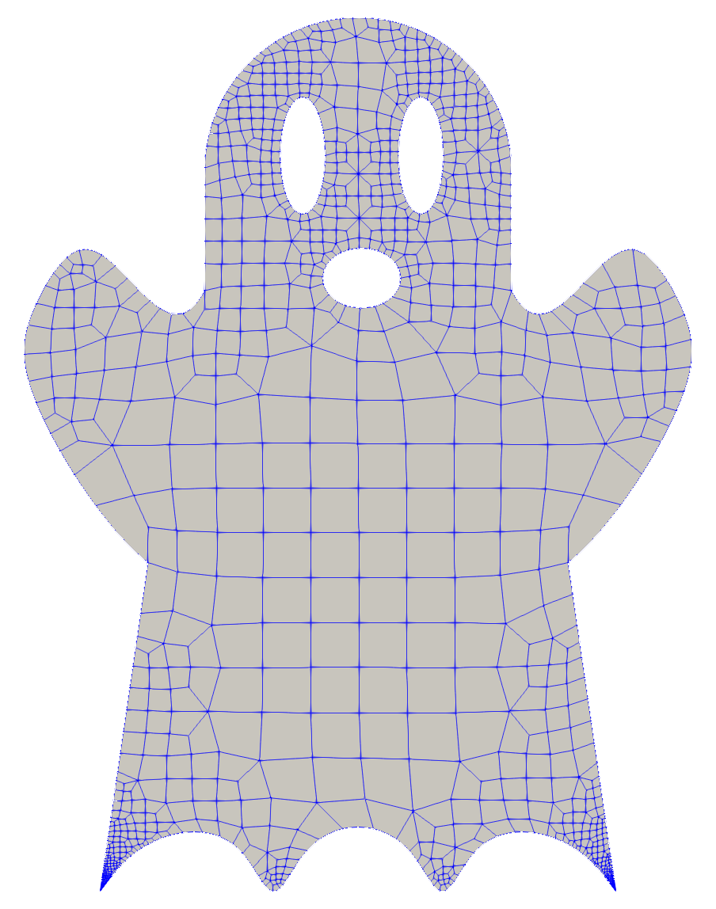

<!---
Interesting meshes can be added below, with new categories added as needed. A two-column
format is used, so to add two plots, use

  
   [Contributor. Description]: #
  
   [Contributor. Description]: #

and for a single,

  
   [Contributor. Description]: #

The Contributor is who submitted the mesh. For now Contributor. Description are in comments. If someone knows how to add captions to the plots, and acknowlegements for
who contributed them, that would be nice to have those added and use these for the caption.

At some point these figures should be moved out of the repo to where the other figures are located.

-->

# A HOHQMesh Mesh Gallery

Please add interesting contributions!

## Exterior Domains

  
  [Contributor?. Cylinder with a wake region]: #
   
  [David A. Kopriva. NACA0012 Airfoil]:

  
   [Andrew R. Winters. Three element Airfoil from http://www.ae.metu.edu.tr/tuncer/ae546/multi/]: #
 
  [Andrew R. Winters. NACA6412 Airfoil from https://github.com/cfsengineering/GMSH-Airfoil-2D]: #

## Coastlines

  
  [David A. Kopriva. Indian Ocean]: #  
   
  [David A. Kopriva. Lake Superior]: #  

  
  [Joe Schoonover. East coast of the US]: #  
   
  [Andrew R. Winters.  Reyran river valley down to the Mediterranean sea]: #  

## Embedded

  
  [David A. Kopriva. Three embedded circles]: #

## Topography

  
  [Andrew R. Winters.  Mount St. Helens from above]: #  
   
  [Andrew R. Winters.  Mount St. Helens, perspective view]: #  

  
  [Joe Schoonover. East coast of the US with topography]: #  

## Just for Fun

  
  [Andrew R. Winters. Trixi logo]: #  
   
  [Garrett Byrd. Jack o'Lantern]: #  

  
   [Andrew R. Winters. Ghost]: #  
 
  [Andrew R. Winters. Snowman]: #  

  
  [David A. Kopriva. Gingerbread Man]: #  
	
  [Andrew R. Winters. Juliai logo]: #  

