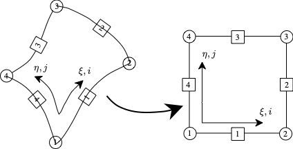
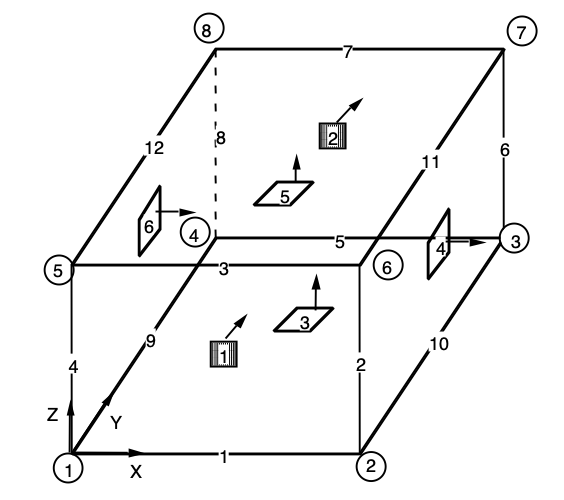
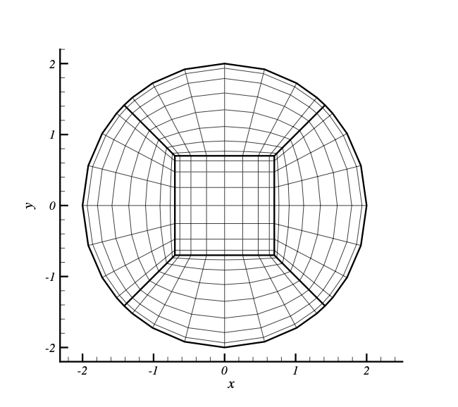

# The ISM Mesh File Formats

The ISM format was developed for the book "Impementing Spectral Methods: Algorithms for Scientists and Engineers" by David A. Kopriva and it supplies all the information needed to define high order curved elements of a spectral element mesh. Over time the format has evolved, with version ISM-2 and ISM-MM added to include edge information, and to handle multiple materials.

The ISM mesh file format can define either Quad or Hex elements. Quad elements are defined as in ISM and shown in Fig. 1 below,

 Fig. 1. The Quad element definition with corners (circles) and sides (squares) ordered.

Hex elements are defined in a standard finite element topology,

 Fig. 2. The Hex element definition with corners (circles) and faces (squares), ordered.

## ISM

The ISM format includes node and element connectivity, with additional edge interpolation data to define high order boundary information. It can define either 2D quad elements or 3D Hex elements, however at the present time there is no header to define what the element type is, which is inferred from the number of nodes that define the corners.

The top level view of the ISM file format is:

	Header
	List of Nodes
	List of Elements
	
The header specifies the size of the mesh and the order of the polynomial that is used to define boundary curves

	#nodes  #elements  polynomial Order
	
The list of nodes includes the (x,y,z) locations of the #nodes nodes in an ordered list

	x1 y1 z1
	x2 y2 z2
	.
	.
	.
	xN yN zN

The list of elements is an ordered list of element blocks,

	e1
	e2
	.
	.
	.
	eN
	
Each element block includes enough information to define a spectral element. Each block has

	node IDs of the four/eight corners
	Boundary flags for the sides/faces (0 = straight/flat, 1 = curved)
	Interpolation values for the curved sides
	Boundary names for sides/faces

The node IDs are the IDs (as determined by their location in the list) of the nodes defined in the Node block. 

	node1 node2 node3 node4 [node5 node6 node7 node8]

The boundary flags are defined similarly,

	bf1 bf2 bf3 bf4 [b5 b6]
	
where the boundary numbering is defined counter-clockwise for Quad elements as defined in the book "Implementing Spectral Methods", and are defined as for standard Hex finite elements for Hex elements.

Finally, for each element boundary curve (or boundary face) for which the boundary flag = 1, a list of nodal values (x,y,z) is specified in order. The knots are assumed defined at the reversed Chebyshev Gauss-Lobatto points, -cos(j \pi /N). For Quad elements the boundary curve blocks are the nodal values

	x1,y1,z1
	x2,y2,z2
	.
	.
	.
	xO,yO,zO
	
For Hex elements, each block defines a surface patch.

The last line of the element block lists names of the physical boundaries associated with a side/face. 

	name1 name2 name3 name4 [name5 name6]

Interior (element-to-element) boundaries are denoted by --- (three dashes).

### Algorithm

An algorithm for reading a quad mesh can therefore be written as

	Read nNodes nElements pOrder
	For n = 1 to nNodes
		Read x[n] y[n] z[n]
	End
	For n = 1 to nElements
		Read (nodeID[k,n], k = 1,...,4)
		Read (bFlag[k,n], k = 1,...,4)
		For k = 1 to 4
			If bFlag(k) = 1 then
				For i = 0 to pOrder
					Read x[i,k,n] y[i,k,n] z[i,k,n]
				End
			End
		End 
		Read (bName[k,i], k = 1,...,4)
	End

The Hex element block is similar, except that the faces are defined with nodes at the two-dimensional tensor-product of the Chebyshev Gauss-Lobatto points. 

	Read nNodes nElements pOrder
	For n = 1 to nNodes
		Read x[n] y[n] z[n]
	End
	For n = 1 to nElements
		Read (nodeID[k,n], k = 1,...,8)
		Read (bFlag[k,n], k = 1,...,6)
		For k = 1 to 6
			If bFlag(k) = 1 then
				For j = 0 to pOrder
					For i = 0 to pOrder
					   Read x[i,j,k,n] y[i,j,k,n] z[i,j,k,n]
					End
				End
			End
		End 
		Read (bName[k,i], k = 1,...,6)
	End

### Example
As a concrete example, we present the mesh file for a circular domain with five elements, shown in Fig. 8.15 of the book Implementing Spectral Methods, reproduced below. 

 Fig. 3 The Quad mesh for a circle for whose mesh file is shown below.

The mesh has five elements with eight nodes. The outer boundary (called "outer") is eighth order, so it has nine points defined for each curve.

	 8 5 8
	0.7000000000000000 -0.7000000000000000 
	1.4142135623730951 -1.4142135623730949 
	0.7000000000000000 0.7000000000000000 
	1.4142135623730951 1.4142135623730949 
	-0.7000000000000000 0.7000000000000000 
	-1.4142135623730949 1.4142135623730951
	-1.4142135623730954 -1.4142135623730949 
	-0.7000000000000000 -0.7000000000000000 
	1 2 4 3
	0 1 0 0
	1.4142135623730951 -1.4142135623730949
	1.4961851763911174 -1.3271887273283636
	1.6994209839390670 -1.0544990845645972
	1.9103423681217324 -0.5921081291107658
	2.0000000000000000 0.0000000000000000
	1.9103423681217324 0.5921081291107657
	1.6994209839390670 1.0544990845645972
	1.4961851763911171 1.3271887273283638
	1.4142135623730951 1.4142135623730949
	--- outer --- ---
	5 3 4 6 
	0 0 1 0
	-1.4142135623730949 1.4142135623730951
	-1.3271887273283636 1.4961851763911174
	-1.0544990845645970 1.6994209839390670
	-0.5921081291107656 1.9103423681217324
	0.0000000000000000 2.0000000000000000
	0.5921081291107658 1.9103423681217324
	1.0544990845645974 1.6994209839390668
	1.3271887273283638 1.4961851763911169
	1.4142135623730951 1.4142135623730949
	--- outer --- ---
	7 8 5 6 
	0 0 0 1
	-1.4142135623730954 -1.4142135623730949
	-1.4961851763911174 -1.3271887273283636
	-1.6994209839390670 -1.0544990845645970
	-1.9103423681217326 -0.5921081291107655
	-2.0000000000000000 0.0000000000000000
	-1.9103423681217324 0.5921081291107659
	-1.6994209839390668 1.0544990845645974
	-1.4961851763911169 1.3271887273283638
	-1.4142135623730949 1.4142135623730951
	--- --- --- outer
	7 2 1 8 
	1 0 0 0
	-1.4142135623730954 -1.4142135623730949
	-1.3271887273283640 -1.4961851763911169
	-1.0544990845645983 -1.6994209839390662
	-0.5921081291107669 -1.9103423681217322
	0.0000000000000000 -2.0000000000000000
	0.5921081291107663 -1.9103423681217322
	1.0544990845645961 -1.6994209839390677
	1.3271887273283627 -1.4961851763911180
	1.4142135623730949 -1.4142135623730954
	8 1 3 5 
	0 0 0 0
	--- --- --- ---
