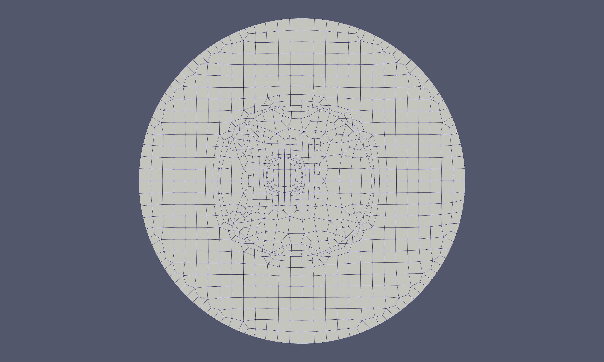

# Introduction

Multidomain spectral methods, of which spectral element methods (SEMs) are a subclass, were introduced by Patera  (for elliptic and parabolic equations) and by Kopriva (for hyperbolic systems) to increase the efficiency of spectral methods and to apply them to complex geometries. Although somewhat controversial at the time -- questions were raised whether it was wise to not use the highest order polynomial possible  for a given number of degrees of freedom -- the methods have become so commonly used within the community that the updated book by Canuto et al.  is subtitled  “Fundamentals in Single Domains.”

The features of spectral element methods are now well-established. Like low order finite element methods, they can be applied to general geometries, but have exponential convergence in the polynomial order. Discontinuous Galerkin (DGSEM) versions applied to hyperbolic problems have exponentially low dissipation and dispersion errors, making them well suited for wave propagation problems. They are also especially suitable when material discontinuities are present. Approximations exist for high order quad/hex and tri/tet elements. Numerous examples of the flexibility and the power of spectral element methods can be found in Canuto et al.’s third volume subtitled “Evolution to Complex Geometries”. Textbooks on the subject now exist, such as those by Deville, Fischer and Mund, Sherwin and Karniadakis , Hesthaven and Warburton, and Kopriva.

What some are now calling “classical” spectral element methods use tensor product bases on quadrilateral or hexahedral meshes. These bases lead to very efficient implementations and have high order quadratures that can be used to approximate the integrals found in weak forms of the equations. The methods are being used in a wide variety of fields including fluid dynamics, electromagnetics, geophysics, and fluid-structure interaction problems, just to name a few.

Unfortunately, meshes for quad/hex elements are considered to be difficult to generate even for low order finite element approximations. This has lead to the development of triangular/tetrahedral spectral element bases. These methods can adapt the meshes generated by virtually all mesh generation packages today in two and three space dimensions. What one gives up in trade is the efficiency of the derivative evaluations, the Gauss quadratures, and meshes well-suited for boundary layer computations.

### Spectral Element Grid Generation

The advantages not withstanding, a major frustration in - and impediment to - the application of spectral element methods has been the lack of appropriate general purpose mesh generation software. A survey of the literature, practitioners, and user manuals for available spectral element software packages such as SemTex, SEM2DPack, or Nekton, highlights these difficulties. Blackburn's SemTex page [http://users.monash.edu.au/~bburn/semtex.html]() notes that “Mesh generation can be a significant hurdle to new users” and includes “a number of example meshes ... (most of which were generated by hand).” SEM2DPack's manual says it “can only generate a structured mesh for a single quadrilateral domain, possibly with curved sub-horizontal boundaries and curved sub-horizontal layer interfaces.” Sherwin and Peiro's comment:  “The ability to construct suitable computational meshes is currently a significant limiting factor in the development of compact high-order algorithms in very complex geometries” still holds today. Canuto et al. do not even broach the subject.

Simply put, and avoiding the common colloquialism, the state of the art in spectral element grid generation has been dismal.
One finds that spectral element meshes are either generated “by hand”, by special purpose mesh generators, or by low order finite element packages. Examples of hand generated meshes can be found in the textbooks listed above, for instance. SEM2DPack interfaces with the low order finite element mesh generator EMC2. The Nekton and SemTex packages interface with the finite element package GMSH. But the situation is particularly difficult for ``classical'' quad and hex element codes since even low order finite element mesh generators for these elements are hard to find. A consequence is that one even finds meshes in the literature that are simple quad/hex decompositions of low order triangular/tetrahedral meshes.
The meshes that practitioners generate differ greatly from those generated by finite element mesh generators. The reason is not just a matter of the tedium associated with the process. Spectral element approximations encourage the use of larger elements with curved boundaries approximated at high order. Meshes generated by hand or with simple templates tend to have fewer and larger elements.

Meshes generated by finite element packages designed for low order elements generate huge numbers of small elements and do not exploit the efficiency of high order spectral element approximations. The use of standard generators can lead one to use a high order method, yet approximate curved boundaries as segments of straight lines. Commercial mesh generators that generate “higher order elements”, e.g.  PATRAN, GMSH or Gambit, do exist, but high order usually means third order, tops. ICEM-HEXA will guarantee quad/hex spectral element type meshes only for block structured meshes. The costs of commercial packages, however, are so far above the budgets provided by the typical NSF grant or mathematics department and so aren’t an option even if they could generate spectral element meshes.

### HOHQMesh
For these reasons we have developed the High Order Hex-Quad Mesh (HOHQMesh) package to automatically generate all-quadrilateral meshes with high order boundary information to be used in spectral element computations. It also can take such two dimensional meshes and extrude them in the normal direction to general all hex meshes for simple extrusion type geometries.

## Example Meshes

Before going into details, we show some meshes that have been generated by HOHQMesh. Control files for generating these meshes can be found in the Examples directory. Some of the meshes show internal spectral element degrees of freedom and the fully accurate boundary representations. Others show only the quad or hex shape of the elements as given in the plot file generated by the program.

The first example is a full spectral element mesh for three circles within an outer circle. HOHQMesh is fully automatic and sizes the elements according to the geometry.

 Fig. 1. Sixth order spectral element mesh of three circles within a circle (<em>Examples/2D/Circles3</em>)

The second example example shows that general curves can be used to define the boundaries. This time, a set of points and a spline are use to define the outer boundary.

 Fig. 2. Eighth order spectral element mesh of a domain bounded by a spline curve (<em>Examples/2D/Spline</em>)

HOHQMesh has templates to automatically mesh around sharp corners.

 Fig. 3. Spectral element mesh of a domain with sharp corners (<em>Examples/2D/CavityRamp</em>)

This makes it possible to mesh airfoil type geometries.

 Fig. 4. Mesh of a NACA0012 airfoil (<em>Examples/2D/NACA0012</em>)

 Fig. 5. Mesh for a three element Karman-Trefftz airfoil (<em>Examples/2D/KT3Element</em>)

Local refinement can be added manually, either at a point or along a line.

 Fig. 6. Mesh showing manual refinement along a line and at a point (<em>Examples/2D/AllFeatures</em>)

Truly complex geometries can be meshed, as shown in the following coastline models. Refinement around features is automatic.

 Fig. 7. The Indian Ocean (<em>Examples/2D/IndianOcean</em>)

 Fig. 8. Lake Superior with spectral element nodes shown (<em>Examples/2D/LakeSuperior</em>)

In some applications, such as if there are regions in which the material properties change abruptly, one may want to include interior interface curves to ensure that element boundaries fall along those curves. Fig. 9 shows a circular domain with two interior circular domains that are separated by interface curves.

 Fig. 9. Mesh with interior interfaces bounded by circles.

Finally, hex meshes can also be created by sweeping a quad mesh. The simplest way is to extrude a two-dimensional mesh in one of the coordinate directions.

 Fig. 10. Simple extrusion of the mesh in Fig. 3 (<em>Examples/3D/CavityRampExtruded</em>)

Or the mesh can be rotated along a coordinate axis through a specified angle,

 Fig. 11. Simple rotation of the mesh in Fig. 3

More sophisticated extrusions can be created by sweeping along a curve,

 Fig. 12. Hex mesh generated by sweeping along a curve (<em>Examples/3D/Snake</em>)

Finally, swept meshes can also be scaled along the curve.

 Fig. 13. Hex mesh generated by sweeping and scaling along a curve

All told, the geometries that can be meshed can be quite general.

 Fig. 14. Quad mesh of a gingerbread man with spectral element nodes shown (<em>Examples/2D/GingerbreadMan</em>)
